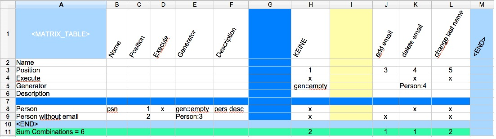
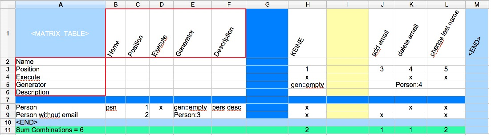
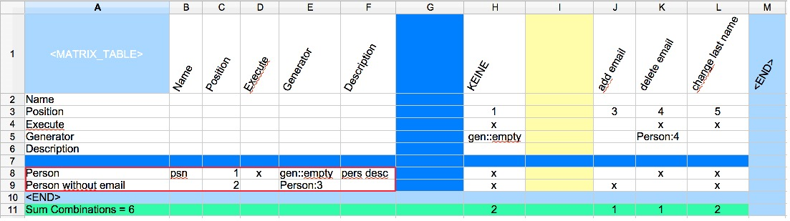
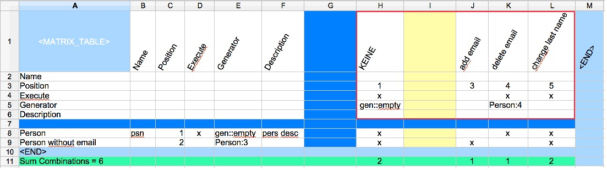

== Matrix Table
This table is used to defined changes on an existing state of an application.
For example the is a decision table for creating a payment. Then this table
may use the created payment as an input and defines rules to bring it to the next state.

The table has a source part and an actions part. The source part refers to a current state.
The action part defines which state change should be applied.

The Matrix itself defines which actions to be applied on which source state.

.The matrix table

This is an example for a matrix table. It is more about the table looks like,
not about the values in the table.

.The header parts

The red shows the header definitions. The same header is used for the columns
and the rows.

.The source part of the table

It is up to the user which part to choose for the source. But here
the source is to the left side.

.The action part of the table

On the right side the action part is located.
